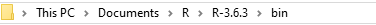
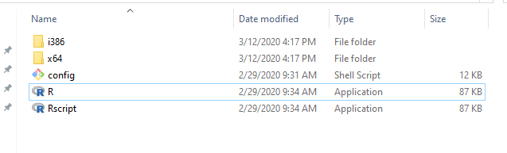

```{r setup, include = FALSE}
knitr::opts_chunk$set(collapse = TRUE,
                      echo = TRUE,
                      warning = FALSE, comment = "")
```

The first step is to install R inside your computer! To do that, you need to visit a the following website: 

**https://cran.r-project.org/bin/windows/base/**

When you open the website, you will see the following page: 

{width=200% height=200%}

Follow the instructions and download the package into an appropriate folder. I recommend setting up a separate **Programs** folder inside **My Documents** and putting R there.

### Accessing R

R is not user friendly. However, we can make it much more approchable by using a program called **RStudio** as an interface between R and us. RStudio makes R easy to use, and also greatly expands what it can be used for. 

I have written a separate section that introduces you to RStudio. It contains all that a beginning needs to know to begin using it with confidence. 

However, it is possible to use R without RStudio, and here I touch briefly upon how to do it. 

Go to where you downloaded R. In my case location is as follows:



These are the files that I see in that folder. You should have something that is similar.



Click on the second last row (that contains the **R** logo). That will open R. 

You should see an interface like the following upon opening R: 


Your R interface probably has a different colour. Very likely the background is white and the letters are black or blue. In any case, what's written in your interface should be very similar to what's written here. 

There ought to be a cursor blinking after the "greater than sign", **>** that lies after the script. 

Enter $str(mtcars)$ after the $>$ sign, as follows:

```{r, eval=FALSE}
> str(mtcars)
```

Do you see the following?

```{r, echo=FALSE}
str(mtcars)
```

If so, congratulations! R is working and you can begin to start coding!