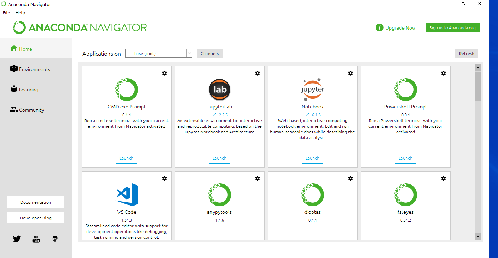
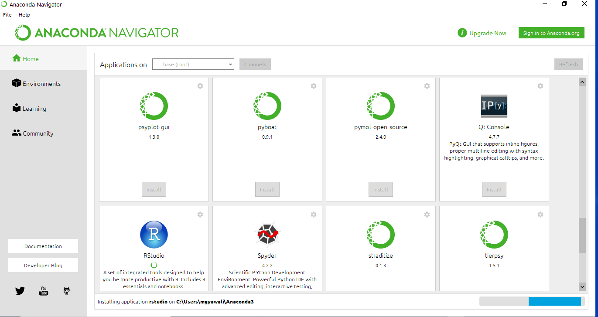

```{r setup, include = FALSE}
knitr::opts_chunk$set(collapse = TRUE,
                      echo = TRUE,
                      warning = FALSE, comment = "")
```


If you don't have administrator privileges, it is difficult to get RStudio. One option is to use the **Anaconda** framework. Anaconda is a programming environment built chiefly around the Python programming language, but it also has support for R, and includes RStudio. 

To install Anaconda go to this page **https://www.anaconda.com/products/individual#windows** first, and scroll down to the very bottom of the page. You will see a section named *Anaconda Installers*. 

That should look like this:


Depending on your operating system and the processor configuration, download the appropriate installer. 

Install the software in an appropriate folder. You cannot install it in the main program folders if you don't have administrative privileges. It is advisable to create a new folder inside the **My Documents** folder called **Programs**. 

Once you have installed it, open it. You may need to click on an **.exe** file for the first time. Install a shortcut, as you will need to use it repeatedly. You can try to locate it in the Search Bar if you're using Windows. 

Once you open it, you should see an interface like this:

{width=150% height=150%}.

Scroll down till you see the **RStudio** logo. 

{width=150% height=150%}

There is a clickable button beneath the logo that states *Install*. Click on that. 

What we're doing now is calling R from within Anaconda. R should come pre-installed with Anaconda. If not, you need to download R separately and connect the two softwares later. 

